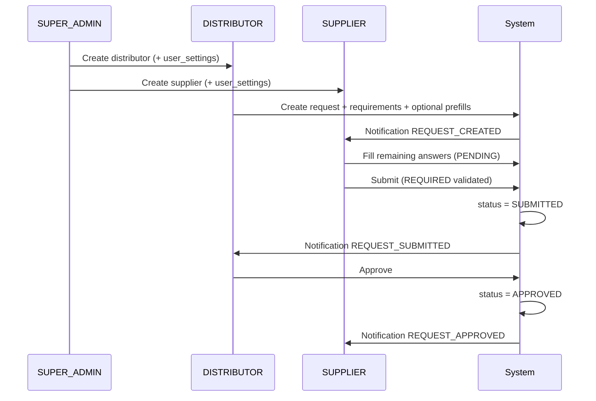
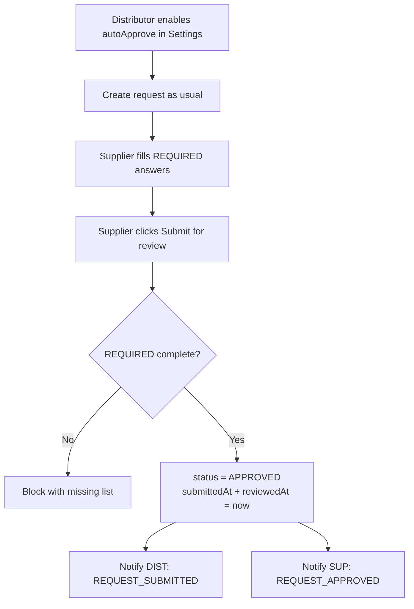
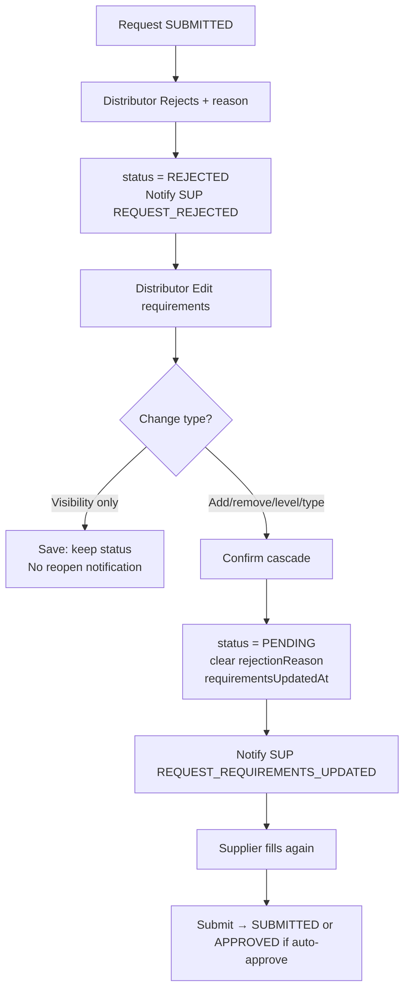

# Supplier Compliance Portal — UI/UX Design

**Product:** Supplier Compliance Portal  
**Stack:** Next.js 16 App Router · React 19 · Tailwind 4 · TypeScript  
**Status:** Design only (frontend is greenfield aside from a login stub)  
**Source of truth (business):** `supplier-compliance-protal/docs/e2e-product-approval-flow.md` + Prisma schema  

---

## 1. Product principles

1. **Ask vs answer is always visible**  
   Every product request screen separates *what was asked* (requirements: type, REQUIRED/OPTIONAL, PUBLIC/PRIVATE) from *what was answered* (file/text, filled vs missing). Prefills from the distributor look like answers, not like hidden asks.

2. **Status is the primary orientation cue**  
   `PENDING` → `SUBMITTED` → `APPROVED` | `REJECTED` drives which primary actions appear. Users should never hunt for “what do I do next?”—the page headline + primary CTA answer that.

3. **Role clarity over shared screens**  
   Same route may render different chrome and CTAs by role (`SUPER_ADMIN`, `DISTRIBUTOR`, `SUPPLIER`). Labels stay role-honest: distributors “Create request” / “Approve”; suppliers “Complete & submit”; admins “Create users” and may act with distributor tools where API allows.

4. **Compliance density, not marketing polish**  
   Desktop-first data UI: dense tables, clear filters, scannable badges. No dashboard card grids of vanity metrics. Cards only wrap interactive work surfaces (e.g. a requirement row editor, a review decision panel).

5. **One job per section**  
   Wizard steps, detail tabs, and settings pages each do one job. Rejection reason, requirements edit, and messaging are not crammed into one scroll wall without structure.

6. **Trust through auditability**  
   Timestamps (`submittedAt`, `reviewedAt`, `requirementsUpdatedAt`), rejection reason, and notification deep-links make the compliance trail readable without leaving the product.

7. **Public vs private is a first-class control**  
   Visibility is set per requirement and reflected in UI (badge + helper text). Public pages never imply private documents exist beyond a generic “additional materials on file” if we choose to show anything at all—default: only PUBLIC answers.

---

## 2. Information architecture (route map)

Authenticated app lives under `(app)` with a shared shell. Auth and public routes stay outside the shell.

```text
/login                          Auth — login (current stub evolves here; `/` redirects)
/                               Redirect → /dashboard if authed, else /login

/(app)/dashboard                Role-specific home
/(app)/users                    User directory (SUPER_ADMIN, DISTRIBUTOR)
/(app)/users/new                Create user wizard/modal target
/(app)/users/[id]               User detail (read + limited edit)

/(app)/products                 Product request list (+ status filters)
/(app)/products/new             Create request wizard (DISTRIBUTOR; SUPER_ADMIN if allowed)
/(app)/products/[id]            Request detail (role-adaptive)
/(app)/products/[id]/edit      Edit request metadata / prefill while PENDING (distributor)
/(app)/products/[id]/requirements
                                Edit requirements (incl. reject → reopen path)
/(app)/products/[id]/review    Approve / reject (distributor; SUBMITTED)
/(app)/products/[id]/messages  Message thread (REQUEST_MESSAGE)

/(app)/notifications            Inbox
/(app)/settings                 User settings (auto-approve for distributor)

/p/[publicSlug]                 Public product page (no app shell; PUBLIC only)
```

### Route access matrix

| Path | SUPER_ADMIN | DISTRIBUTOR | SUPPLIER | Anonymous |
|---|---|---|---|---|
| `/login` | ✓ | ✓ | ✓ | ✓ |
| `/dashboard` | ✓ | ✓ | ✓ | — |
| `/users`, `/users/new`, `/users/[id]` | ✓ (all roles) | ✓ (create SUPPLIER; see own-created + relevant) | — | — |
| `/products` | ✓ (all) | ✓ (own as distributor) | ✓ (own as supplier) | — |
| `/products/new` | ✓* | ✓ | — | — |
| `/products/[id]` | ✓ | ✓ (party) | ✓ (party) | — |
| `/products/[id]/review` | ✓* | ✓ | — | — |
| `/products/[id]/requirements` | ✓* | ✓ | — | — |
| `/products/[id]/messages` | ✓ | ✓ (party) | ✓ (party) | — |
| `/notifications` | ✓ | ✓ | ✓ | — |
| `/settings` | ✓ | ✓ | ✓ (limited) | — |
| `/p/[publicSlug]` | ✓ | ✓ | ✓ | ✓ |

\*Admin may create/review if product policy allows admin-as-distributor; UI should support it with an explicit “acting as distributor” context when needed.

### Soft delete

Soft-deleted products (`isDeleted`) leave the default list. Optional filter: **Show deleted**. Detail of deleted request is read-only with banner **This request was deleted** and no approve/submit CTAs.

---

## 3. Role-based navigation (app shell)

### Shell layout (desktop)

```text
┌──────────────────────────────────────────────────────────────┐
│ Top bar: Logo “Compliance Portal” | Global search (optional) │
│          | Bell (unread count) | Avatar menu (Settings, Out) │
├────────────┬─────────────────────────────────────────────────┤
│ Side nav   │ Page header (title + primary CTA)               │
│            │ Breadcrumbs when nested                         │
│            ├─────────────────────────────────────────────────┤
│            │ Main content                                    │
│            │                                                 │
└────────────┴─────────────────────────────────────────────────┘
```

- Side nav width ~240px; collapse to icons &lt;1024px.
- Active item: left accent bar + medium weight label (not a card).
- Unread badge on **Notifications** and top-bar bell (same count).

### Nav items by role

| Nav label | Href | SUPER_ADMIN | DISTRIBUTOR | SUPPLIER |
|---|---|---|---|---|
| Dashboard | `/dashboard` | ✓ | ✓ | ✓ |
| Users | `/users` | ✓ | ✓ | — |
| Product requests | `/products` | ✓ | ✓ | ✓ |
| Notifications | `/notifications` | ✓ | ✓ | ✓ |
| Settings | `/settings` | ✓ | ✓ | ✓ |

**Avatar menu:** Profile name + role chip · Settings · Log out.

**Supplier label nuance:** Nav still says **Product requests** (not “My tasks”) so vocabulary stays shared; empty/dashboard copy can say “Requests assigned to you.”

---

## 4. Key screens

### 4.1 Login — `/login`

**Job:** Authenticate; redirect by role to `/dashboard`.

**Layout**

- Centered column (~400px), light surface on cool gray app background.
- Brand mark + product name above form (stronger than current “Welcome Back!” alone).
- Fields: **Email Address** *, **Password** * (show/hide), primary **Log In**.

**States**

| State | Behavior |
|---|---|
| Loading | Button → **Signing in…**, inputs disabled |
| Error | Inline alert under form: “Invalid email or password” (no field enumeration beyond that) |
| Empty validation | Native/required messages on blur/submit |
| Success | Hard navigate to `/dashboard` |

**Out of scope MVP:** Forgot password, SSO.

**Existing stub:** `components/pages/LogInPage.tsx` — teal accents already; evolve into brand-aligned tokens (see §7).

---

### 4.2 Dashboard — `/dashboard`

**Job:** Answer “what needs me?” in one screen. No vanity KPI cards.

#### SUPER_ADMIN

- **Page title:** Dashboard  
- **Primary CTA:** **Create distributor** → `/users/new?role=DISTRIBUTOR`
- **Sections (stacked, one job each):**
  1. **Needs attention** — table rows: recent SUBMITTED across distributors (if admin reviews) + users missing settings (edge).
  2. **Recent users** — last 5 created (name, role, email, created).
  3. **Recent requests** — last 5 (name, SKU, status, distributor, supplier).

#### DISTRIBUTOR

- **Primary CTA:** **New product request** → `/products/new`
- **Sections:**
  1. **Awaiting your review** — `SUBMITTED` count + compact list (max 5) → link **View all**.
  2. **Waiting on suppliers** — `PENDING` / `REJECTED` awaiting resubmit.
  3. **Auto-approve** status line: “Auto-approve is **On/Off**” + link **Manage in Settings** (not a settings form on the dashboard).

#### SUPPLIER

- **Primary CTA:** none global; first incomplete PENDING row has **Continue**.
- **Sections:**
  1. **Action required** — PENDING (incomplete required items) + REJECTED.
  2. **Submitted / in review** — SUBMITTED.
  3. **Approved** — last few APPROVED (link only).

**Empty:** Illustration-free empty line + CTA (“No requests yet. Create a product request.” / “No requests assigned to you.”).  
**Loading:** Skeleton rows in each section.  
**Error:** Banner **Couldn’t load dashboard** + **Retry**.

---

### 4.3 Users — `/users`, `/users/new`, `/users/[id]`

**Job:** Create and browse distributors/suppliers (+ `user_settings` defaults on create).

#### List `/users`

- Filters: Role (`All` / `DISTRIBUTOR` / `SUPPLIER` / `SUPER_ADMIN` for admin), Search (name/email).
- Columns: Name · Email · Role · Created by · Created · Actions (**View**).
- Primary CTA:
  - Admin: **Create user** (opens role picker: Distributor | Supplier).
  - Distributor: **Create supplier**.

#### Create `/users/new?role=DISTRIBUTOR|SUPPLIER`

- Fields: **Name** *, **Email** *, **Temporary password** * (or **Send invite** if API later), optional photo.
- On success: create user + `user_settings` defaults (`autoApproveProductRequests = false`).
- Toast: **Distributor created** / **Supplier created** → navigate to `/users/[id]`.
- Distributor cannot create DISTRIBUTOR or SUPER_ADMIN (role control disabled/hidden).

#### Detail `/users/[id]`

- Header: name, role badge, email.
- For distributors: read-only note of auto-approve (actual toggle lives on *that user’s* Settings when they log in—or admin-only override in v1.1).
- Related requests count link to filtered `/products?supplierId=` or `distributorId=`.

**Empty / loading / error:** Standard table patterns (§4.4).

---

### 4.4 Product request list — `/products`

**Job:** Find requests by status and party; enter create or detail.

**Page header**

- Title: **Product requests**
- Primary CTA (admin/distributor): **New request**
- Filters (horizontal chip/select row, not a card wall):
  - Status: `All` | `PENDING` | `SUBMITTED` | `REJECTED` | `APPROVED`
  - Search: name / SKU
  - Supplier (distributor/admin)
  - Distributor (admin)
  - **Show deleted** toggle (off by default)

**Table columns**

| Column | Notes |
|---|---|
| Product | Name + optional thumb |
| SKU | mono |
| Status | `StatusBadge` |
| Supplier | name |
| Distributor | name (hide for distributor viewing own) |
| Updated | relative time |
| Actions | **Open** |

Row click → `/products/[id]`.

**Empty:** “No product requests match these filters.” + clear filters / New request.  
**Loading:** Table skeleton.  
**Error:** Banner + Retry.

---

### 4.5 Create / edit product request wizard — `/products/new`, `/products/[id]/edit`

**Job:** Distributor selects supplier, defines ask matrix, optionally prefills answers, creates `PENDING` request + `REQUEST_CREATED` notification.

#### Stepper (3 steps)

```text
1. Product & supplier  →  2. Requirements  →  3. Prefill (optional)  →  Create
```

**Step 1 — Product & supplier**

- **Product name** * · **SKU** (optional; uniqueness among non-deleted) · **Price** · **Photo**
- **Supplier** * — searchable select of all `role = SUPPLIER` (no pre-link). Helper: “Any supplier account can be selected.”
- Buttons: **Cancel** · **Continue**

**Step 2 — Requirements matrix**

Two stacked sections (one job each): **Documents** then **Fields**.

Each row:

| Control | Purpose |
|---|---|
| Type select | Built-in `DocumentType` / `FieldType`, or **OTHER** |
| Label + customKey | Required when OTHER; hidden/disabled for built-ins (`customKey = ''`) |
| Level | Segmented: **Required** / **Optional** |
| Visibility | Segmented: **Public** / **Private** |
| Remove | Trash (disabled if last required doc? — allow empty matrix only with confirm) |

Actions: **Add document requirement** · **Add field requirement** · **Back** · **Continue**.

Validation: OTHER without `customKey`/`label` blocked with inline error.

**Step 3 — Prefill (optional)**

- Lists only requirements from step 2.
- Per row: upload (docs) or textarea (fields), marked **Prefill (optional)**.
- Helper: “Prefills count toward submit. Supplier completes the rest.”
- Buttons: **Back** · **Skip prefill** · **Create request**

**Success:** Toast **Request created** → `/products/[id]` (PENDING). Supplier receives inbox notification.

**Edit while PENDING** (`/products/[id]/edit`): Same fields for metadata/prefill upserts; requirements deep-link to `/requirements`. If status ≠ PENDING, edit metadata may be locked (v1.1 decision: lock after SUBMITTED except messages).

---

### 4.6 Supplier request detail / fill & submit — `/products/[id]`

**Job:** Complete missing answers; submit when all REQUIRED satisfied.

**Header**

- Product name · SKU · `StatusBadge` · parties (Distributor · Supplier)
- Progress: **Required complete: 3/4** (docs+fields)
- Primary CTA by state:

| Status | Supplier CTA |
|---|---|
| PENDING | **Save draft** (autosave optional) + **Submit for review** (enabled when required complete) |
| SUBMITTED | Disabled **Submitted** + copy “Waiting for distributor review” |
| REJECTED | Banner with reason + **Update answers** then **Resubmit** when valid |
| APPROVED | **Approved** state; read-only answers; link **View public page** if slug |

**Body layout (two columns desktop)**

- **Left (ask/answer list):** Document requirements, then field requirements. Each item:
  - Label / type
  - Badges: Required|Optional, Public|Private
  - Answer control or read-only value
  - State chip: **Filled** / **Missing** / **Prefill** (if filled before supplier edit—optional cue)
- **Right rail:** Timeline (created, requirements updated, submitted, reviewed) · **Messages** shortcut · Public slug link (copy)

**Submit validation**

- Client: block with summary list “Missing required: Test report”.
- Server error: same pattern via toast/banner.

**Auto-approve path (supplier view):** On submit success, if status returns `APPROVED`, toast **Submitted and approved** and badge flips to APPROVED (no “waiting for review” flash if API is synchronous).

---

### 4.7 Distributor review — `/products/[id]/review`

**Job:** Approve or reject a `SUBMITTED` request.

**Entry:** From detail primary CTA **Review** when status is SUBMITTED (and role allows).

**Layout**

- Read-only requirements + answers (same list as supplier, no upload).
- **Decision panel** (interactive card — allowed):
  - **Approve request** (primary)
  - **Reject request** → reveals **Rejection reason** * textarea + **Confirm reject**
- Cancel → back to detail.

**Success**

- Approve → APPROVED, notify supplier `REQUEST_APPROVED`, toast **Request approved**.
- Reject → REJECTED + reason, notify `REQUEST_REJECTED`, toast **Request rejected** · secondary **Edit requirements** → `/products/[id]/requirements`.

**Wrong status:** Redirect to detail with banner “This request is not awaiting review.”

---

### 4.8 Requirements reopen / edit — `/products/[id]/requirements`

**Job:** Change ask matrix. Visibility-only edits save without reopen. Material changes after REJECTED (or when policy allows) set status `PENDING`, set `requirementsUpdatedAt`, clear `rejectionReason`, notify `REQUEST_REQUIREMENTS_UPDATED`.

**UI**

- Same matrix as wizard step 2, pre-populated.
- Banner when status is REJECTED: **Editing requirements will reopen this request to PENDING and notify the supplier.**
- Save modes:
  - **Save visibility only** — if diff is visibility-only; keep status; no supplier reopen notification.
  - **Save & reopen for supplier** — when levels/types/adds/removes change (or explicit after reject). Confirm modal: lists cascade delete warning for removed requirements’ answers.
- Buttons: **Cancel** · **Save changes** (smart: detect visibility-only vs material).

**Empty matrix:** Warn before save.

---

### 4.9 Notifications inbox — `/notifications`

**Job:** User inbox; deep-link to product when `productRequestId` set.

**List**

- Filters: Unread / All · type (optional).
- Item: unread dot · title · message snippet · relative time · type icon · product name if linked.
- Click: mark read + navigate `/products/[id]` (or stay if no link).
- Bulk: **Mark all as read**.

**Types → default titles (examples)**

| Type | Title example |
|---|---|
| REQUEST_CREATED | New compliance request |
| REQUEST_SUBMITTED | Request submitted for review |
| REQUEST_APPROVED | Request approved |
| REQUEST_REJECTED | Request rejected |
| REQUEST_REQUIREMENTS_UPDATED | Requirements updated |
| REQUEST_MESSAGE | New message on request |
| REQUEST_DELETED | Request deleted |

**Empty:** “You’re all caught up.”  
**Loading / error:** Standard.

Top-bar bell opens the same list as a popover (desktop) with **View all**.

---

### 4.10 User settings — `/settings`

**Job:** Preferences; room to grow via typed columns on `user_settings`.

**Sections**

1. **Account** (read-only email/name; password change = v1.1)
2. **Product request defaults** (DISTRIBUTOR only):
   - Toggle **Auto-approve product requests**  
     Helper: “When on, a valid supplier submit sets the request to Approved immediately. You still get a submitted notification.”
3. **Notifications** (future): email digests — show disabled placeholders only if needed; prefer omit until real.

**Supplier / Admin:** Section 2 hidden or disabled with note “Auto-approve applies to distributor accounts only.”

**Save:** Explicit **Save settings** or optimistic toggle with toast **Settings saved**.

---

### 4.11 Public product page — `/p/[publicSlug]`

**Job:** Shareable, unauthenticated view of PUBLIC documents/fields only.

**Layout (minimal chrome, not app shell)**

- Product name · optional public photo · SKU if public policy allows (default: show name; SKU optional).
- **Public documents** — download/preview links.
- **Public information** — field labels + values.
- No private requirements listed (not even as “locked”).
- Footer: “Provided via Supplier Compliance Portal” · no login CTA required (optional discreet **Sign in**).

**States:** Not found · Deleted → generic 404. Loading skeleton.

---

### 4.12 Messages thread — `/products/[id]/messages`

**Job:** Side-channel discussion; sending creates `ProductMessage` and notifies counterpart via `REQUEST_MESSAGE`.

**Layout**

- Sticky page header with product + status + **Back to request**.
- Chronological thread (sender name, role chip, timestamp, body).
- Composer: textarea + **Send message**.
- Empty: “No messages yet. Ask a clarifying question about this request.”

**Permissions:** Only parties (distributor, supplier) + admin. Soft-deleted: read-only thread.

---

## 5. Component inventory

Reusable building blocks (suggested `components/ui/*` + `components/domain/*`):

| Component | Responsibility |
|---|---|
| `AppShell` | Side nav + top bar + content region |
| `PageHeader` | Title, description, primary/secondary actions |
| `StatusBadge` | PENDING / SUBMITTED / REJECTED / APPROVED (+ soft-deleted) — color **and** text |
| `RoleBadge` | SUPER_ADMIN / DISTRIBUTOR / SUPPLIER |
| `RequirementLevelToggle` | REQUIRED \| OPTIONAL segmented control |
| `VisibilityToggle` | PUBLIC \| PRIVATE segmented control |
| `RequirementsMatrix` | Editable/read-only document + field rows |
| `RequirementRow` | Type, OTHER fields, level, visibility, remove |
| `AnswerField` | Textarea bound to field requirement |
| `FileUploadField` | Upload/replace/remove document; show fileName |
| `CompletionMeter` | “Required 3/4” progress |
| `FilterBar` | Chips/selects for list pages |
| `DataTable` | Sortable dense table + empty/loading slots |
| `EmptyState` | Title + description + optional CTA (no heavy illustration) |
| `ConfirmDialog` | Destructive / reopen confirms |
| `DecisionPanel` | Approve / reject + reason |
| `NotificationItem` | Inbox row + unread affordance |
| `NotificationBell` | Top-bar trigger + unread count |
| `MessageThread` / `MessageComposer` | Request messages |
| `UserSelect` | Searchable supplier (or user) picker |
| `WizardStepper` | Step labels + current index |
| `Toast` / `InlineAlert` | Feedback |
| `Skeleton` | Rows/forms |
| `PublicProductView` | Public slug page sections |
| `SoftDeletedBanner` | Read-only deleted state |
| `RejectionBanner` | Shows `rejectionReason` |

**Form primitives:** `TextField`, `TextArea`, `Select`, `Checkbox`, `Switch`, `Button` (primary / secondary / danger / ghost), `IconButton`.

---

## 6. User flows

### 6.1 Happy path (manual approve)



### 6.2 Auto-approve path



### 6.3 Reject → reopen → resubmit



---

## 7. Visual direction

Compliance B2B: **cool teal ink on cool gray**, dense and calm. Extends the existing login stub (`#1595a0`, `#123a3c`) into a full token set—not purple SaaS, not cream/terracotta, not broadsheet.

### 7.1 CSS variables (proposed)

```css
:root {
  /* Surfaces */
  --bg-app: #f4f7f7;
  --bg-elevated: #ffffff;
  --bg-muted: #e8eeee;
  --bg-inset: #dff0f1;

  /* Ink */
  --text-primary: #123a3c;
  --text-secondary: #4a6365;
  --text-muted: #7a8f90;
  --text-inverse: #ffffff;

  /* Brand / action */
  --brand-500: #1595a0;
  --brand-600: #117f89;
  --brand-700: #0e6a72;
  --brand-100: #d5eef0;

  /* Borders */
  --border-subtle: #d5e0e0;
  --border-strong: #b7c8c9;
  --focus-ring: #55aeb5;

  /* Status (pair with labels — never color alone) */
  --status-pending-bg: #eef2f6;
  --status-pending-fg: #3d4f5f;
  --status-submitted-bg: #e7f1fb;
  --status-submitted-fg: #1e4d7b;
  --status-approved-bg: #e3f5ea;
  --status-approved-fg: #1b5e3b;
  --status-rejected-bg: #fce8e6;
  --status-rejected-fg: #8f2d24;

  /* Feedback */
  --danger-500: #c23b2e;
  --warning-500: #b88214;
  --success-500: #1f7a45;

  /* Elevation — sparse */
  --shadow-sm: 0 1px 2px rgba(18, 58, 60, 0.06);
  --radius-sm: 6px;
  --radius-md: 9px;
  --radius-lg: 12px;

  /* Typography */
  --font-sans: var(--font-source-sans-3), "Source Sans 3", system-ui, sans-serif;
  --font-display: var(--font-ibm-plex-sans), "IBM Plex Sans", system-ui, sans-serif;
  --font-mono: var(--font-ibm-plex-mono), "IBM Plex Mono", ui-monospace, monospace;
}
```

### 7.2 Typography

| Role | Face | Use |
|---|---|---|
| UI / body | **Source Sans 3** | Forms, tables, body (via `next/font`) |
| Display / page titles | **IBM Plex Sans** | Page headers, login brand line |
| SKU / IDs / timestamps | **IBM Plex Mono** | Dense data |

Avoid Inter, Roboto, Arial as primary. Replace current `globals.css` Arial body rule when implementing.

**Scale (desktop):** 12px labels · 13–14px body/table · 18–22px page titles · 500/600 weights for hierarchy (not heavy black marketing weights).

### 7.3 Density & chrome

- Table row height ~40–44px; compact padding.
- Side nav: flat list, 1px border separator, brand teal active indicator.
- Prefer **section headers + tables/lists** over nested cards.
- Cards **only** for: login form surface, DecisionPanel, composer, interactive requirement editor group when needed.
- Shell background `--bg-app`; content panels `--bg-elevated` with hairline border, not multi-layer shadows.

### 7.4 Motion

- 120–180ms ease for hover/focus color and drawer.
- Toast enter/exit only; no hero parallax or decorative motion.
- Status badge change: brief crossfade (150ms) after approve/submit.
- Respect `prefers-reduced-motion: reduce` (disable non-essential transitions).

---

## 8. Responsive notes

**Desktop-first** (≥1280px primary; 1024–1279 usable with collapsed nav).

| Breakpoint | Behavior |
|---|---|
| ≥1280px | Full side nav + optional right rail on detail |
| 1024–1279 | Collapsed icon nav; detail rail stacks below |
| 768–1023 | Top bar + hamburger drawer nav; tables → horizontal scroll with sticky first column (Product) |
| &lt;768 | Single column; wizard steps full-bleed; filters in **Filters** bottom sheet; primary CTAs sticky bottom on fill/submit and review |

**Forms:** Stack labels above inputs always. Requirement matrix on mobile: each requirement as a stacked block (not multi-column row).

**Public page:** Single column, comfortable reading width ~40rem.

---

## 9. Accessibility checklist

- [ ] All interactive controls keyboard-reachable; visible `:focus-visible` using `--focus-ring`
- [ ] Form fields have visible `<label>` (not placeholder-only); required indicated with text/symbol + `aria-required`
- [ ] Status conveyed by **text + color** (`StatusBadge` includes word PENDING, etc.)
- [ ] Required/Optional and Public/Private toggles expose `aria-pressed` / radiogroup semantics
- [ ] File upload: associated label, announced filename on change, keyboard activate
- [ ] Notifications: unread state not color-only (dot + `aria-label` “Unread”)
- [ ] Dialogs: focus trap, `Esc` closes, return focus to trigger
- [ ] Toasts: `role="status"` / `aria-live="polite"`; errors `assertive` where appropriate
- [ ] Contrast ≥ WCAG AA for text/badge pairs on their backgrounds
- [ ] Skip link to main content in app shell
- [ ] Icon-only buttons have accessible names (Show password, Mark read, etc.)
- [ ] Tables: `<th scope="col">`; sortable columns announce sort direction
- [ ] Disabled Submit explains why via linked error summary (`aria-describedby`)
- [ ] Public page images have alt text; decorative icons `aria-hidden`

---

## 10. Phased implementation (MVP → v1.1)

### MVP — core compliance loop

| Phase slice | Routes / UI | Notes |
|---|---|---|
| M0 Auth shell | `/login`, redirect `/`, `AppShell` stub | Evolve existing `LogInPage` |
| M1 Users | `/users`, `/users/new`, `/users/[id]` | Admin: distributor+supplier; Dist: supplier |
| M2 List + create | `/products`, `/products/new` | Wizard steps 1–3; notify on create |
| M3 Supplier fill | `/products/[id]` (supplier mode) | Prefill display; submit validation |
| M4 Manual review | `/products/[id]/review` | Approve/reject + reason |
| M5 Settings auto-approve | `/settings` | Distributor toggle; submit → APPROVED path |
| M6 Notifications | `/notifications` + bell | Deep-link `productRequestId` |
| M7 Requirements reopen | `/products/[id]/requirements` | Visibility-only vs reopen |

**MVP success:** Full e2e happy path + auto-approve + reject-reopen demonstrable in UI against API.

### v1.1 — collaboration & public

| Slice | Routes / UI |
|---|---|
| Messages | `/products/[id]/messages` + REQUEST_MESSAGE notifications |
| Soft delete | List filter, detail banner, confirm **Delete request** |
| Public page | `/p/[publicSlug]` |
| Edit metadata | `/products/[id]/edit` polish |
| Password change / invite email | Settings + create-user invite |
| Admin cross-distributor filters | Stronger `/products` admin tooling |
| Global search | Top bar → users/products |

### v1.2+ (backlog)

- Email notification preferences  
- Bulk approve  
- Audit log page  
- Localization  

---

## Appendix A — Primary button label catalog

| Context | Label |
|---|---|
| Login | Log In |
| Create distributor | Create distributor |
| Create supplier | Create supplier |
| Create request | Create request |
| Wizard continue | Continue |
| Skip prefill | Skip prefill |
| Supplier save | Save draft |
| Supplier submit | Submit for review |
| Distributor open review | Review |
| Approve | Approve request |
| Reject | Reject request / Confirm reject |
| Reopen save | Save & reopen for supplier |
| Visibility save | Save changes |
| Send message | Send message |
| Mark all read | Mark all as read |
| Soft delete | Delete request |
| Settings | Save settings |
| Copy public link | Copy public link |

---

## Appendix B — Status → allowed actions (UI)

| Status | Supplier | Distributor |
|---|---|---|
| PENDING | Edit answers, Submit | Edit requirements, Prefill, Delete, Message |
| SUBMITTED | View, Message | Review (Approve/Reject), Message |
| REJECTED | Edit answers, Resubmit | Edit requirements (reopen), Message |
| APPROVED | View, Public link, Message | View, Public link, Delete, Message |
| Deleted | View read-only | View read-only |

---

*End of design doc. Implementation should follow this document and project skills under `.agents/skills/` before coding screens.*
